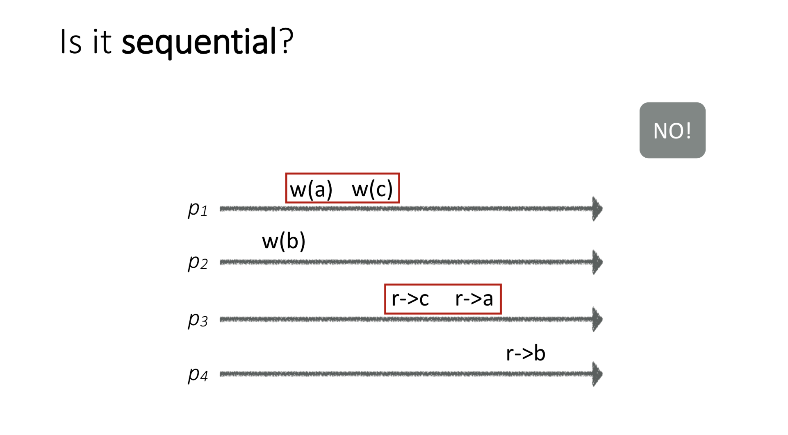
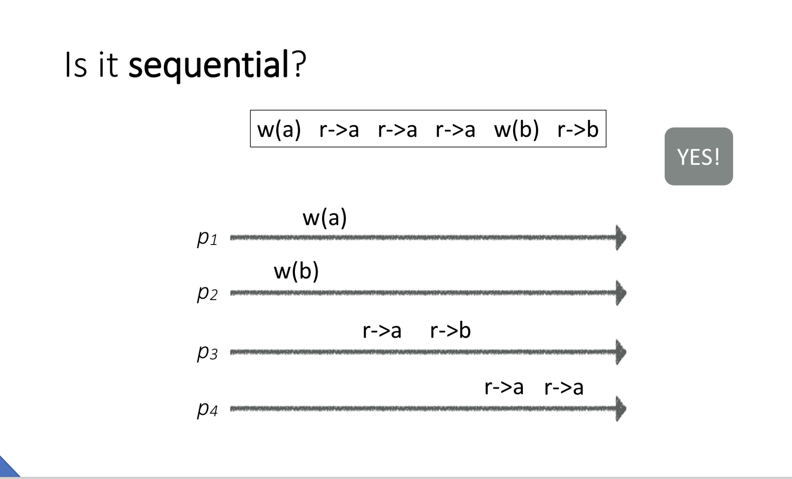
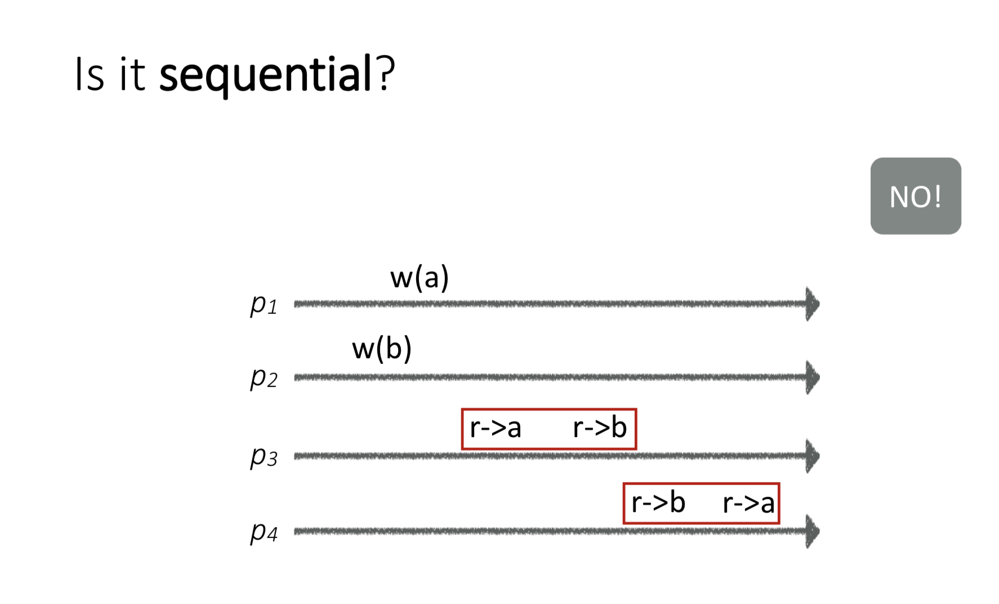

```text
    this is a repo of the art of multiprocess programming implemetations. We will
use go  program languages. There will be a rust repo for spec chapts.
```
## 第一章
```go
    实现了读者写者问题和生产者消费者的模拟程序
```
## 第二章
```go
    实现了LockOne和LockTwo以及两者的集合版本PeterSon算法,不过他们都是针对两个
线程的锁算法，前两者都是不完美的算法,而PeterSon则是满足无死锁,满足互斥,满足无饥
饿的完美算法.
    实现了FilterLock和BakeryLock算法,这两种算法都是针对多线程的锁算法,都是无死锁,
满足互斥,满足无饥饿.
    目前是实现有点问题，线程全部结束后,writer.num有时会出现比预期值小1的情况，这是
因为会出现指令重排序，可能出现类似的Lock()执行的时候跑到了writer.num的后面的情况,这
种情况下就导致并发写num了，这种是无法阻止的,结论就是软件是无法实现锁的，必须依赖硬件
    本章的其它内容也推荐好好读一读
```
## 第三章
```go
    第三章比较理论.如果光读书,我觉得会感觉很多地方说的不够清晰。
    这一章重点需要知道的是静态一致性,顺序一致性,线性一致性，这是三种对并发程序的正确性
的描述.我查阅了许多资料，按照这样理解:
    1.静态一致性:指的是在并发程序执行的过程当中,并发对象的状态,都等价于已执行结束的操作
按照某种顺序就可以达到,同时静态一致性并不关心单个线程内部的执行次序.比如,有一个结构体有
两个字段a,b（初始位0）;然后有一个操作是同时修改a,b做自增操作；但是如果在某个静态条件下
 a = 2;b = 1;这样就不满足静态一致性，因为你无顺序调用write方法达到这个效果(永远得到的
 都是a和b相等).
    2.顺序一致性:看下面的图片.线性一致性的是要求保证任何单个线程的内部的程序执行次序对
于其它线程来说看到的都是一样的,他要求的单个线程内部的顺序，而不是一个全局的，因此这是一
种弱一致性的.
    3.线性一致性:在顺序一致性的基础之上,做了更进一步的加强，一旦对于某一个并发的对象被做
了新的修改或者有线程读到了这个线程的新值,后续其它线程读都得看到最新值.这是一种就近的保证,
也是强一致性的.(像下面的图2虽然满足顺序一致性,但是不满足线性一致性)
    在分布式系统当中,这里的顺序一致性和线性一致性同样适用.
这里还有几个书当中提到的几个结论我觉得需要知道:
    1.静态一致性和顺序一致性不可比较,因此不要说哪一个对正确性的保证要求更高,他们只是从不
同的角度来定义的一种正确性规则.
    2.静态一致性和线性一致性是可复合的，而顺序一致性则不行
    3.对于并发编程来说，现代的并发编程语言的当中,实现并发对象的技术都是可线性话的,比如go里
的锁的使用，你可以使用锁来保证整个程序并发的按照特定的顺序执行.
```



## 第四章
```go
    ToDo:目前更新完第三章，下一周更新第四章.
```